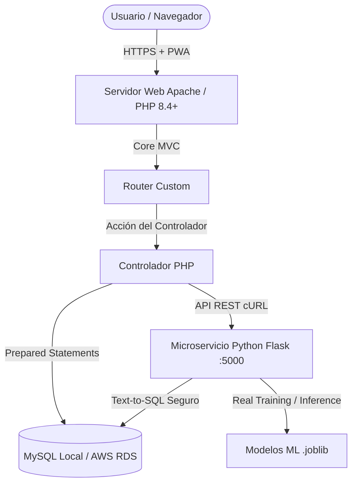
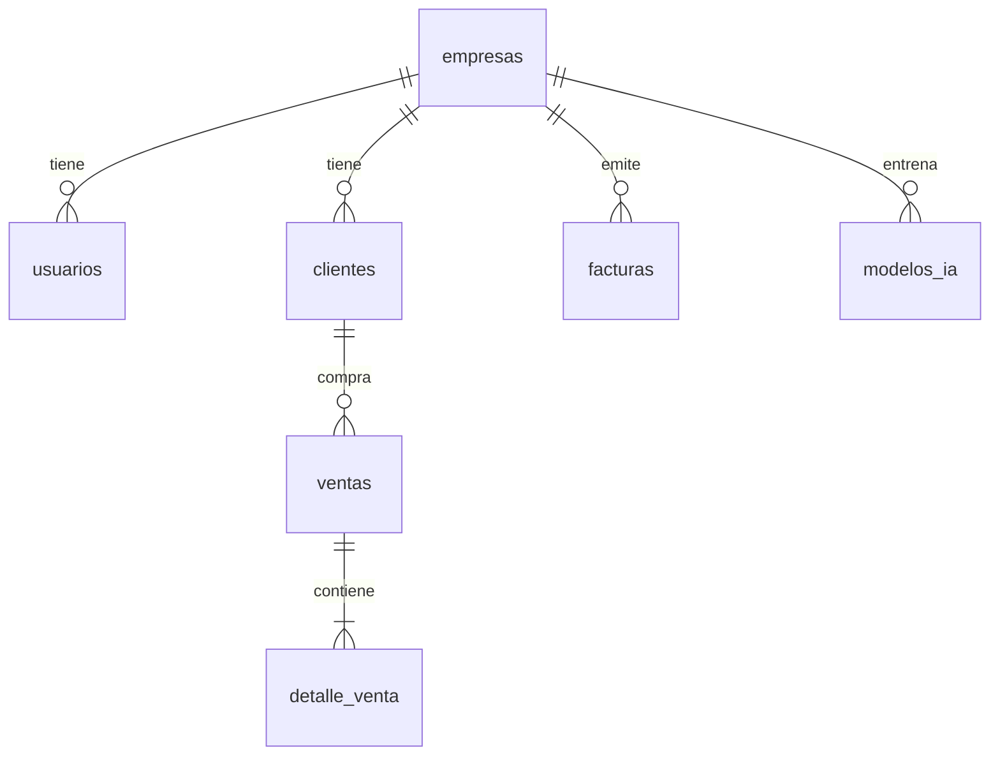
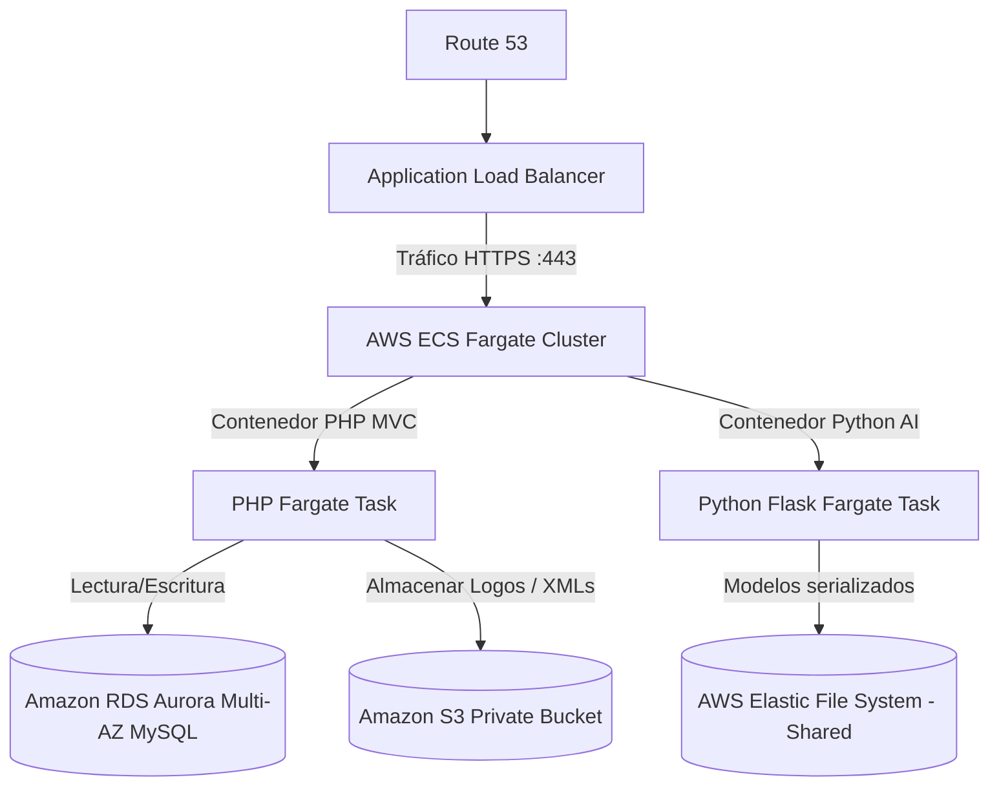

# MANUAL TÉCNICO Y ARQUITECTURA DE FAXEL BI
## Plataforma SaaS Empresarial de Inteligencia de Negocios + Facturación Electrónica UBL 2.1 + IA Predictiva

---

## 1. ARQUITECTURA GLOBAL DEL SISTEMA
FAXEL BI está construido bajo un enfoque híbrido de alto rendimiento compuesto por:
1. **Frontend**: Bootstrap 5 + JavaScript + CSS3 Custom + Chart.js.
2. **Backend Web**: Arquitectura MVC hecha a medida en PHP 8.4+ puro sin dependencias externas pesadas, garantizando una carga rápida (sub-segundo) y total soberanía del código.
3. **Microservicio de IA**: API REST de Python 3.10 ejecutando Flask, pandas, numpy, scikit-learn y Prophet.
4. **Base de Datos**: MySQL con soporte Multiempresa (Multi-tenancy) y lógica embebida (triggers/vistas/procedimientos).

---

## 2. DISEÑO Y MULTITENANCY DE BASE DE DATOS
El esquema implementa **Aislamiento Multi-inquilino de Datos (Multi-tenancy)** mediante discriminación por columna `empresa_id` en todas las tablas transaccionales y maestras.

### Principales Tablas Multiempresa
* **`empresas`**: Almacena los datos fiscales (RUC, Razón Social, Dirección, Logo, Sector, Empleados) de cada cuenta SaaS registrada.
* **`usuarios`**: Posee claves cifradas con `bcrypt` (cost=12) y está asociado a un `empresa_id` y un rol ACL.
* **`clientes`**: Catálogo de clientes de la empresa, donde se registran los resultados de scoring de abandono (`churn_score`, `churn_riesgo`).
* **`facturas` / `ventas`**: Documentos de venta con su respectivo `empresa_id`.
* **`modelos_ia`**: Registro de entrenamiento de los modelos de Machine Learning (Prophet, RandomForest, XGBoost, etc.) específicos de cada empresa con sus métricas.

---

## 3. MÓDULO DE FACTURACIÓN ELECTRÓNICA CPE (UBL 2.1)
El módulo genera comprobantes válidos (Facturas y Boletas) siguiendo el estándar de SUNAT (Perú).
1. **UBL 2.1 XML Generator**: Genera la estructura XML estándar con tags de impuestos (IGV 18%), importes totales en letras, datos del emisor, adquirente y líneas de detalle.
2. **Firma Digital**: Aplica simulación de firma con algoritmo SHA-256 y guarda el tag `Signature` en el XML.
3. **Respuesta CDR (Constancia de Recepción)**: Genera el archivo CDR de respuesta simulando la validación del CPE por la SUNAT, emitiendo un estado "Aceptada".
4. **PDF Representación Impresa**: Genera un reporte PDF con la estructura reglamentaria de SUNAT e inserta un código de barras PDF417 simulado y código QR conteniendo los datos clave del comprobante (`RUC Emisor | Tipo CPE | Serie | Correlativo | IGV | Total | Fecha | RUC Adquirente`).

---

## 4. PIPELINES DE MACHINE LEARNING (PYTHON IA)
El microservicio en Python gestiona de manera real el ciclo de vida de los modelos predictivos de cada empresa.

### 4.1. Predicción de Ventas (Forecast)
* **Algoritmo principal**: Prophet (de Meta) o Regresión Lineal de Scikit-learn (fallback si Prophet no está disponible).
* **Entrada**: Historial diario de ventas (`ds` y `y`).
* **Inferencia**: Calcula proyecciones a 7, 30, 90 y 365 días con intervalos de confianza superior (`yhat_upper`) e inferior (`yhat_lower`).
* **Métricas**: Calcula MAE (Mean Absolute Error), RMSE (Root Mean Squared Error) y R² (coeficiente de determinación).

### 4.2. Riesgo de Abandono (Churn)
* **Algoritmo principal**: RandomForestClassifier (de Scikit-learn) entrenado dinámicamente.
* **Entrada**: `dias_sin_compra`, `total_compras`, `ticket_promedio`, `monto_acumulado`.
* **Inferencia**: Genera un score probabilístico de 0 a 100% y clasifica el riesgo en:
  * **Alto**: `>= 70%` (Requiere campaña urgente)
  * **Medio**: `40% - 69%` (Seguimiento recomendado)
  * **Bajo**: `< 40%` (Estable)

---

## 5. COPILOTO IA Y AGENTE DE TEXT-TO-SQL
El asistente de chat interactúa mediante lenguaje natural con los datos aislados de la base de datos de la empresa:
1. **Intercepción y Clasificación**: Detecta palabras clave en la consulta (`ventas`, `churn`, `utilidad`, `clientes`, `sucursal`).
2. **Text-to-SQL Seguro**: Compila la consulta a un script SQL dinámico inyectando obligatoriamente la condición `empresa_id = :empresa_id` para evitar fugas de información inter-empresa.
3. **Renderizado de Gráficos**: Si la respuesta contiene datos tabulares adecuados, el Chat genera automáticamente un gráfico inline interactivo (barras, líneas o pastel) mediante Chart.js.

---

## 6. SEGURIDAD Y PWA
* **ACL**: Access Control List definido en `core/ACL.php`. Los roles disponibles son `superadmin`, `empresa`, `gerente`, `analista`, `vendedor` y `operador`.
* **PWA**: Configurado con `manifest.json` y `sw.js` (Service Worker) para permitir el caché de activos estáticos, funcionamiento desconectado básico (fallback de red) y soporte para notificaciones push en segundo plano.
* **Prepared Statements**: Todas las consultas PHP SQL usan PDO con bindings estrictos.
* **Sanitización**: Helper `Security::e()` para evitar ataques XSS y `Security::verifyCSRF()` para validación de tokens en solicitudes POST/PUT.

---

## 7. PLAN DE MIGRACIÓN FUTURA A AWS (DOCKERIZADO)
Para mover esta plataforma SaaS local a la nube de AWS con alta disponibilidad, siga esta arquitectura propuesta:

### Pasos de la Migración
1. **Containerización**:
   * Escribir un `Dockerfile` para el backend PHP (basado en `php:8.4-apache` instalando extensiones pdo_mysql, zip, gd, etc.).
   * Escribir un `Dockerfile` para el microservicio Python (basado en `python:3.10-slim` instalando las librerías de `requirements.txt`).
2. **AWS Fargate (Serverless Container Orchestration)**:
   * Crear un cluster en AWS ECS.
   * Definir Tareas (Tasks) independientes para el contenedor PHP y el de Python.
3. **Persistencia de Datos**:
   * Migrar la base de datos local a **Amazon RDS MySQL** o **Amazon Aurora MySQL** Serverless con copias de seguridad automáticas y Multi-AZ habilitado para redundancia.
   * Usar **Amazon S3** con la SDK de PHP para almacenar logos corporativos, archivos XML generados y comprobantes PDF de forma segura y económica.
   * Montar **AWS EFS** (Elastic File System) en el servicio ECS de Python para almacenar y cargar archivos de modelos entrenados (`.joblib`) compartidos entre contenedores.
4. **Red y Cifrado (VPC)**:
   * Configurar VPC con subredes públicas y privadas. Los contenedores de ECS y base de datos RDS deben estar en subredes privadas.
   * Poner un **Application Load Balancer (ALB)** en la subred pública que redirija el tráfico de internet a los contenedores Fargate.
   * Cifrar todo el tráfico SSL/TLS con certificados gestionados gratis en **AWS Certificate Manager (ACM)** a través de **Amazon Route 53**.
